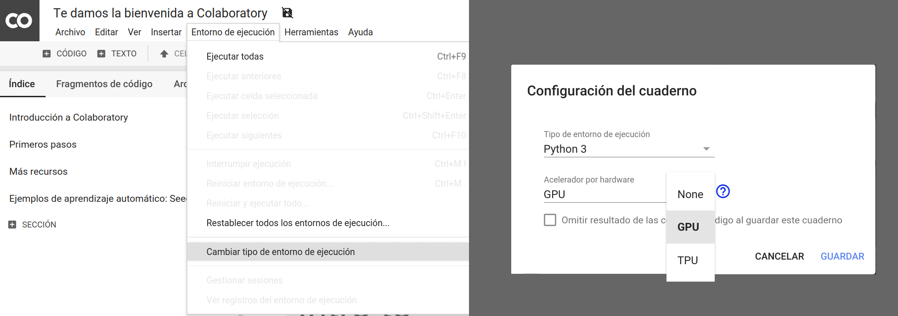
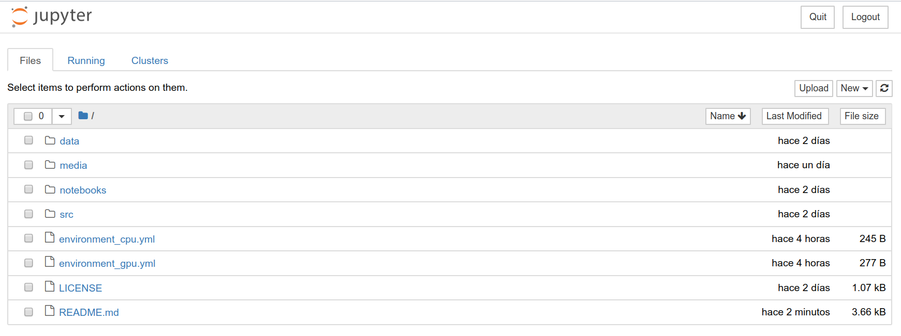

# Curso de aprendizaje profundo 2022-1, PCIC-UNAM
Este repositorio contiene las diapositivas, libretas y tareas del curso de aprendizaje profundo del [Posgrado en Ciencia e Ingeniería de la Computación](http://www.mcc.unam.mx/) de la [UNAM](https://www.unam.mx/).


## Temario
1. Redes densas
2. Redes convolucionales
3. Redes recurrentes
4. Redes basadas atención
5. Estrategias de entrenamiento
6. Redes generativas
7. Temas selectos

## Ambiente de programación

Para ejecutar los ejercicios y las libretas de este repositorio se tienen dos opciones:

* Google Colab
* Ambiente local

### Google Colab

[Google Colab](https://colab.research.google.com) es un servicio para crear, editar, alojar y ejecutar libretas en la nube. Ofrece ambientes con CPU, GPU y TPU de forma gratuita, aunque con un tiempo máximo de ejecución.

Se sugiere trabajar en un ambiente GPU, el cual puedes activar de la siguiente manera:
* Abre el menú `Entorno de ejecución`
* Elige la opción `Restablecer todos los entornos de ejecución...` .
* Vuelve a abrir `Entorno de ejecución`
* Elige `Cambiar tipo de entorno de ejecución`
* Selecciona Python 3 como `Tipo de ejecución` y GPU de la lista de `Acelerador por hardware`



Puedes crear una nueva libreta (*notebook*) desde Colab, subir una existente desde tu computadora o importarla de Google Drive o GitHub.

### Ambiente local
Para instalar el ambiente en nuestra computadora primero debemos instalar Anaconda siguiendo las [instrucciones](https://docs.anaconda.com/anaconda/install/) oficiales. Después, desde una terminal creamos el ambiente con el archivo de dependencias:

```
conda env create --f environment.yml
```

Enseguida, activamos el ambiente:

```
conda activate cap
```

Posteriormente, para comenzar a trabajar con las libretas ejecutamos:

```
jupyter notebook
```

Este comando abrirá una pestaña o ventana en tu navegador web, como se muestra en la siguiente captura de pantalla:



Aquí puedes crear una nueva libreta seleccionando el botón `New` y posteriormente `Python 3`. También puedes cargar una existente seleccionando un archivo con extensión `.ipynb` dentro del directorio donde se lanzó el comando. Con `Upload` agregas archivos que se encuentran en otra parte de tu computadora a este directorio. Para salir, simplemente presiona el botón `Quit` y cierra la pestaña o ventada correspondiente.

Para desactivar el ambiente

```
conda deactivate
```
